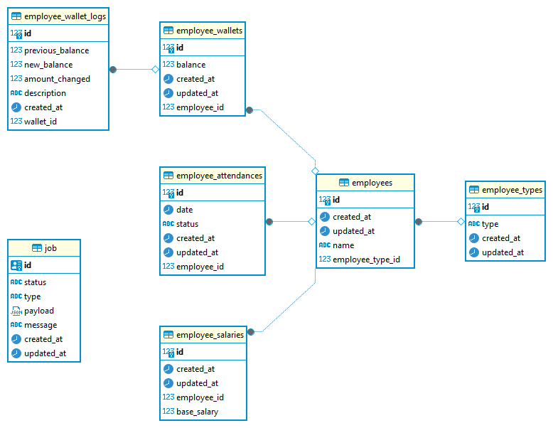
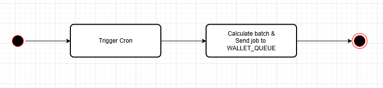
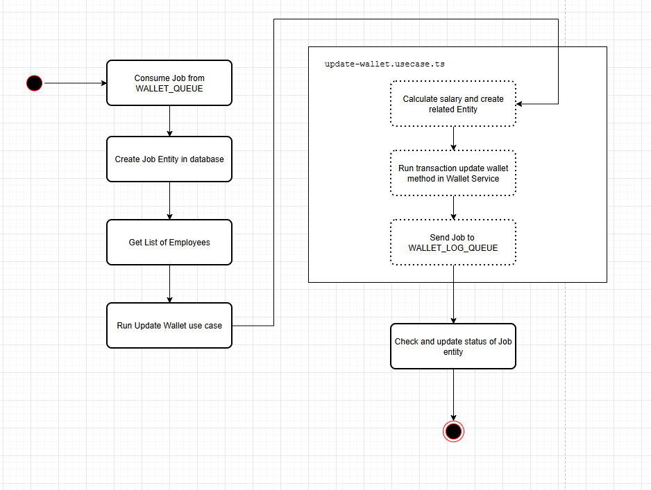
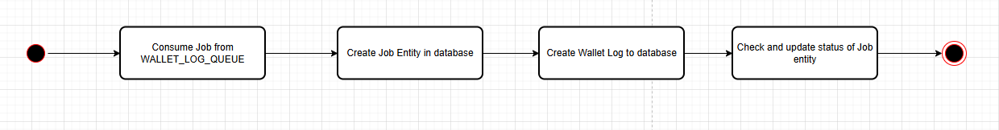

<p style="text-align: center; font-size: 48px;">
  How do I analysis and Implement
</p>

# Introduction

This document provides:

- Domain and Database design
- Infrastructure design
- Source code structure
- Use case workflow

Due to the scope and time constraints, I haven't implemented all the API endpoints needed to fully interact with the features, such as viewing jobs, creating workdays for employees, etc. You can find the APIs I have provided for this evaluation here.

Additionally, I have not implemented dead-letter handling and other advanced operations with the message queue.

# Getting Started

Based on the requirements of the company's evaluation, I can identify and plan the implementation of the database and the code flow. To update all employees in the system (table can has over 1 million records), which involves a large amount of processing, I will use a message queue to reduce the load.

Since the task involves finance, I will use an RDBMS and apply normalization to store the data.

# Domain and Database design

According to the requirements, the problem needs to be solved for employees, so I need a table to store employee information (Employees). Since there are two types of employees, I will create a table to store information about the employee types, making it easier to extend in the future. For now, I will define two types of employees: part-time and full-time. Full-time corresponds to monthly, and part-time corresponds to daily. Later, other types such as temporary or freelance can be added.

To handle salaries, I will need to store important salary information for employees, so I will create a table (employee_salaries). For this test, I will only store basic salary information. Although I could store this in the employees table directly with just one field, it would be difficult to expand in the future, so I want to keep it separate. Fields like bonus and income_additional can be added to this table later on.

To calculate working days, I'm not sure about the specific calculation method, so I will assume that an API with webhooks will be used to manage this. I will store the working day information for employees in a separate table (employee_attendances). This table will track the attendance records of employees.

Next, for updating balances, I will create a separate table to store and update balances (employee_wallets). Additionally, I will create another table to log balance updates for employees (employee_wallet_logs).

I have implemented a message queue, so I also need to set up a table to store job information to monitor whether user data is fully updated.

So, i will have 7 tables for solve the core function.

- employees
- employee_types
- employee_salaries
- employee_wallets
- employee_wallet_logs
- employee_attendances
- jobs

At this point, I **will not create constraints** for my tables to save time and focus on the main features required by the evaluation. **I will describe how I would create constraints** for the columns and tables if I were to implement them.

About Index and Partition, I also didn't include them in this project.

## Table Meaning

### Employee

For this table, I will only store the name and the type of employee.

Relationship: Employee (1,n) ---- (1,1) Employee Type

The structure of the table will be:

```
+---------------------+
|      employees      |
+---------------------+
| id PK               | // Auto increment
| name                |
| employee_type_id FK |
| created_at          |
| updated_at          |
+---------------------+
```

### Employee Type

For this table, I will store the type of employee.

The structure of the table will be:

```
+------------------+
|  employee_types  |
+------------------+
| id PK            | // Auto increment
| type             | // At this time has 2 records, full-time and part-time
| created_at       |
| updated_at       |
+------------------+
```

### Employee Salary

For this table, I will store the salary information of employee. An Employee only have a salary information.

Employee only has 1 salary information (CONSTRAINT UNIQUE employee_id)

Relationship: Employee 1 ---- 1 Salary.

The structure of the table will be:

```
+-------------------+
| employee_salaries |
+-------------------+
| id PK             | // Auto increment
| base_salary       | // Base salary value depends on employee type, if "full-time", it will base salary for monthly, otherwise for daily
| employee_id FK    |
| created_at        |
| updated_at        |
+-------------------+
```

### Employee Wallet

For this table, I will store the balance of employee.

Wallet must has balance (CONSTRAINT NOT NULL balance)

Employee only has 1 wallet (CONSTRAINT UNIQUE employee_id TABLE)

Relationship: Employee 1 ---- 1 Wallet.

The structure of the table will be:

```
+-------------------+
| employee_wallets  |
+-------------------+
| id PK             | // Auto increment
| balance           | // the current balance of employee
| employee_id FK    |
| created_at        |
| updated_at        |
+-------------------+
```

### Employee Wallet Log

For this table, I will store the action of wallet of employee.

Log must has previous_balance, new_balance, amount_changed, description and created_at (CONSTRAINT NOT NULL for each left column)

Relationship: Wallet (1,1) ---- (1,n) Wallet Log.

The structure of the table will be:

```
+-----------------------+
| employee_wallet_logs  |
+-----------------------+
| id PK                 | // Auto increment
| previous_balance      |
| new_balance           |
| amount_changed        | // amount_changed = new_balance - previous_balance
| description           | // store the message about the action of wallet. At this time, i only store message "Increase the wallet"
| wallet_id FK          |
| created_at            | // store the created day of logs
| updated_at            |
+-----------------------+
```

### Employee Attendance

For this table, I will store the working day of employee. The working day will have a status, this status will determine how the employee works that day, it can be normal work, vacation or unauthorized leave from which the working days in the month can be calculated for employee.

Each employee only has 1 day corresponds with 1 record in table. (CONSTRAINT UNIQUE (employee_id, date))

Status has 3 values: PRESENT, LEAVE and ABSENT (CONSTRAINT NOT NULL status TABLE) (and create enum for this column)

Relationship: Employee (1,1) ---- (1,n) Attendance.

The structure of the table will be:

```
+-----------------------+
| employee_attendances  |
+-----------------------+
| id PK                 | // Auto increment
| date                  | // The working day of employee, 
| status                |
| employee_id FK        |
| created_at            |
| updated_at            |
+-----------------------+
```

### Jobs

For this table, I will store the action of wallet of employee.

Job must has status, type (CONSTRAINT NOT NULL status TABLE), (CONSTRAINT NOT NULL type)

Relationship: Wallet (1,1) ---- (1,n) Wallet Log.

The structure of the table will be:

```
+-----------------------+
| jobs                  |
+-----------------------+
| id PK                 | // varchar - uuid
| status                | // At this time, job has 2 status are COMPLETED and FAILED
| type                  | // To determine the event of job. At this time, job has 2 types are UPDATE_WALLET and CREATE_WALLET_LOG
| payload               | // At this time, job only stores employee_id[], batch and paging, what is this? I will tell you after
| message               | // store the message about job, error or any thing. At this time, i only store error if function has error
| created_at            |
| updated_at            |
+-----------------------+
```

## Diagram



## Seeds

I have to written the scripts to seed for 5 tables, you can read mock data and script to run seeding in the [folder seeds](../src/infrastructure/database/seeds/).

For:

- Employee: [mock data](../src/infrastructure/database/seeds/mocks/employee.json), create 3 employee records
- Employee type: [mock data](../src/infrastructure/database/seeds/mocks/employee-type.json), create 2 employee type records (full time and part time)
- Employee salary: [mock data](../src/infrastructure/database/seeds/mocks/employee-salary.json), create 3 salary Information for 3 employees
- Employee wallet: [mock data](../src/infrastructure/database/seeds/mocks/employee-wallet.json), create 3 wallets for 3 employees
- Employee attendance: [mock data 1](../src/infrastructure/database/seeds/mocks/employee-attendance-nguyen-van-a.json) | [mock data 2](../src/infrastructure/database/seeds/mocks/employee-attendance-nguyen-van-b.json) | [mock data 3](../src/infrastructure/database/seeds/mocks/employee-attendance-pham-dong-b.json), create attendance for 3 employees

Script: I implemented [script](../src/infrastructure/database/seeds/scripts/employee.script.ts#L272) to [app.service](../src/app.service.ts#L30)

`Every times you start the application, seed will runs and only create record if table doesn't have any records (at the first times)`

# Infrastructure Design

## Overview

This project is built using NestJS, a progressive Node.js framework, to ensure scalable and maintainable code. To handle high traffic and asynchronous tasks, we integrate BullMQ and Redis for message queuing, which helps in reducing load and ensuring efficient processing.

## Technology Stack

- Backend Framework: NestJS, TypeORM
- Message Queue: BullMQ with Redis
- Database: PostgreSQL
- Architecture: Domain-Driven Design

## Infrastructure Component:

1. NestJS:

  - I chose NestJS because it can be easily set up and supports many libraries without requiring manual setup.
  - For this test, I also used it for its rapid development capabilities and because i have to set up from zero.
  - I chose TypeORM because it is simple and quick to set up.

2. BullMQ and Redis:

  - For this evaluation, I chose to implement Redis because it is simple and easy to set up, and I do not need extensive job management. However, for larger and more complex systems, I would implement Kafka instead of Redis to better suit the system's needs.

3. PostgreSQL:

  - A reliable relational database used to store all application data, including employee details, salaries, attendance records, wallets, and job logs.
  - Why not Mysql but Postgresql?

    - Support fully ACID, i thought with finance domain, ACID is extremely important
    - Postgresql supports Index and Partition better Mysql, this use case can handles with over 5 million employees so i need deployment index and partition for every tables.

# Source code structure

In this project, I implemented Domain Driven Design (DDD), although I simplified some concepts to fit the scope of the evaluation. Instead of using the default structure of NestJS, I found that this structure was not suitable for the financial domain, making it difficult to manage and expand.

## Structure

Root Structure:

- src/

  - configuration
  - features

    - name_of_feature

  - infrastructure

  - utils

Feature Structure:

- features/

  - name_of_feature

    - application: Include use case
    - domain: Include entity. I used TypeORM, so entities are also tables.
    - exceptions: Include exception
    - infrastructure: Include dao pattern, dto, service, and table constant
    - presentation: Include controller
    - validates: Include validate for controller and etc. At this point, i only write for controller

## Describe feature

Based on the requirements and the tables I have implemented, I identified two main components that need to be handled: wallet and employee. Therefore, I separated them into different features.

For the [employee feature](../src/features/employee/), I will implement the API endpoints to manage employee information, such as viewing details, creating, and editing employees.

For the [wallet feature](../src/features/wallet/), it will primarily focus on updating the balance. This feature will also handle processing with the queue.

Additionally, since I am using a queue, I will also create a separate feature dedicated to handling queue processing, [job feature](../src/features/job/).

# Use case workflow

When you run the project for the first time, the system will automatically create sample data in the tables, specifically for the employee feature.

Here, I will create 3 employees, along with 3 corresponding wallets, 3 salary records, and the workdays for each of these employees. The attendance records for these 3 employees will cover from the beginning of May until May 28, 2024, in the attendances table. `You can see the test data in Section Seeds`

Based on the requirement to run the balance calculations and updates for employees at midnight, I will implement a cron job using a library provided by NestJS in [app.service.ts](../src/app.service.ts#L36).

Here, I will implement a method to calculate and update the balance for employees, named [scheduleDailyCalculateAndUpdateBalance](../src/app.service.ts#L41).

I will retrieve the current number of employees in the system and then calculate the number of batches needed for processing.

For the scope of this task, I will update one employee per job. Therefore, the formula is: `Total number of employees / number of employees to be updated per job`. After that, I will use a loop to push tasks into the queue.

Here, I have two queues:

- WALLET_QUEUE: used for processing the balance updates for employees,
- WALLET_LOG_QUEUE: used for creating logs to record changes to the wallet.

Based on the batch size, I can calculate the limit and offset to accurately retrieve the exact number of employees that need to be updated for each job.

There are two processors used to consume the jobs from these two queues: [wallet.processor.ts](../src/features/wallet/processors/wallet.processor.ts) and [wallet-log.processor.ts](../src/features/wallet/processors/wallet-log.processor.ts).

### [Wallet Processor](../src/features/wallet/processors/wallet.processor.ts)

In the wallet.processor.ts, it will create and update the job so that we can track and verify if the system has updated all the employees.

Then, it will call the Use Case [update-wallet.usecase.ts](../src/features/wallet/application/commands/update-wallet.usecase.ts) to update and calculate the balances for the employee using the method [execute](../src/features/wallet/application/commands/update-wallet.usecase.ts#L28). **This is also the main function in this project.**

You can read to understand how I handle the calculation and updating of salaries and balances for employees. Additionally, this function will also push tasks into the Wallet_Log_Queue to handle the logging of balance updates for employees.

### [Wallet Log Processor](../src/features/wallet/processors/wallet-log.processor.ts)

In the wallet-log-processor.ts, it also creates and update the job so that we also can track and verify the log of wallet.

After that, will creates the wallet log entity to database.

```
You can see below illustrations to more understand
```

### Illustration

**First step:**

In `app.service.ts`:



**Second Step:**

In `wallet.processor.ts`, `update-wallet.usecase.ts` and `wallet.service.ts`



**Third Step:**

In `wallet-log.processor.ts`



Done.
